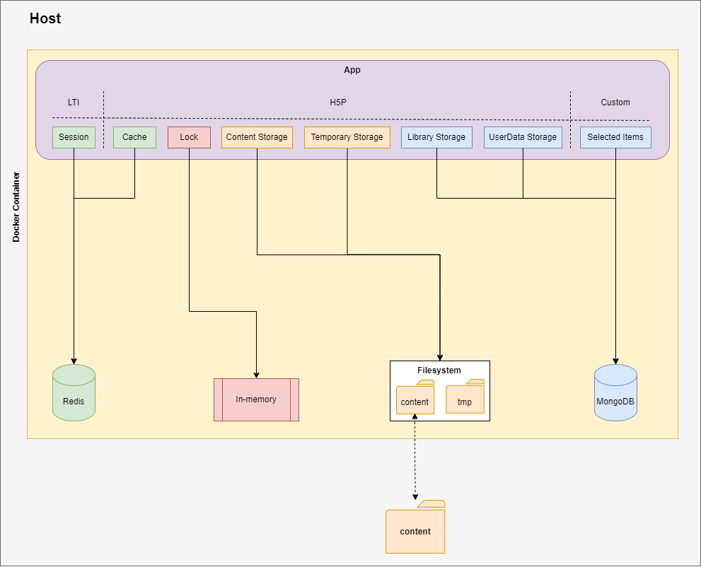
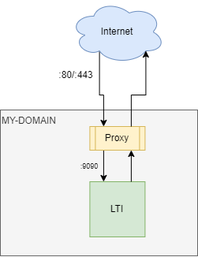
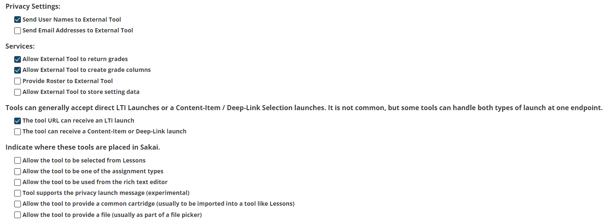
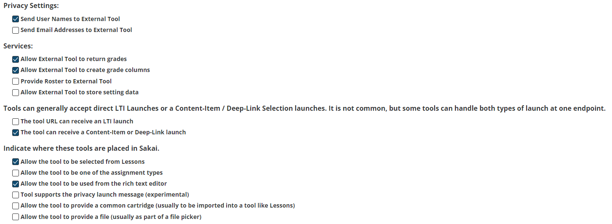
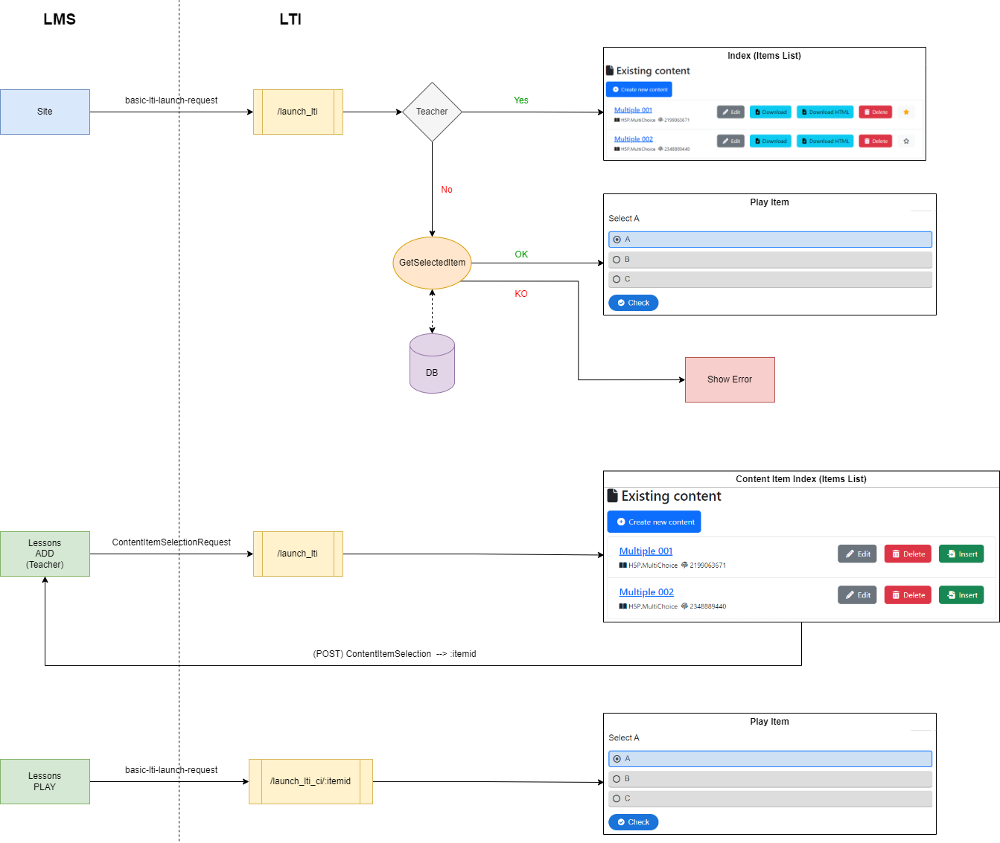

# H5P LTI Provider

## Intoduction

This is an LTI tool designed to provide H5P contents to an LMS. Its origin comes from the S2U project (https://sakaiproject.atlassian.net/browse/S2U-41) where was demmanded to create such kind of tool.
This tool is developed in NodeJS and is based in two libraries:
- Lumi H5P: https://www.npmjs.com/package/h5p-nodejs-library (better search for @lumieducation/h5p-* packages) --> https://github.com/Lumieducation/H5P-Nodejs-library
- IMS-LTI: https://www.npmjs.com/package/ims-lti --> https://github.com/omsmith/ims-lti

IMS-LTI library only supports LTI v1.0, and it has been addapted to work with Content Item requests.

As this tool is based on lumi H5P library, it can be configured to work and store data in different ways:
- Cache: in-memory | redis | none (default)
- Lock (used in multi-node/clustered environment): redis | in-memory (default)
- Library storage: mongo | mongo + S3 | filesystem (default)
- User Data storage: mongo | filesystem (default)
- Content storage: mongo + S3 | filesystem (default)
- Temporary storage: S3 | filesystem (default)

We have packaged all this tool, one redis and one mongodb services in a docker compose project, so we can run everything with a default configuration in few steps.

**Important**: Content storage is configured to save everything inside the filesystem. This filesystem is linked with the host "content" folder via a Docker volume. Be sure this folder has the right writing permissions (especially in Linux systems) or contents cannot be created.




## Running from Docker {#docker}

- Create .env and provider/.env files from their .example
  - Adjust .env variables to match your environment.
  - Ajust these variables in provider/.env file according your environment:
    - SERVER_NAME: Our LTI tool domain (ex.: https://h5plti.mydomain.com).
    - ACCEPTED_LTI_CONSUMERS: Which LMS' URLs will be allowed to access our tool (multiple comma separated values are accepted) (ex.: https://trunk-maria.nightly.sakaiproject.org).
    - OAUTH_CONSUMER_KEY and OAUTH_SECRET: LTI related.
    - SESSION_SECRET: Used to secure sessions.
  - Other variables can be left with their default value. Remember to read carefully provider/.env file for advanced configuration.
- Confirm content folder has write permissions.
- Run these commands:
    ```
    docker compose build
    docker compose up

    or

    # FULL (all in one command, clean enviroment)
    docker compose down && docker compose rm -f && docker image prune -f && docker volume prune -f && docker compose build --no-cache && docker compose up -d
    
    # FULL+ (also removes volumes)
    docker compose down -v && docker compose rm -f && docker image prune -f && docker volume prune -f && docker compose build --no-cache && docker compose up -d
    ```

## Running from bash

If you only want to run the NodeJS part outside the docker infrastructure, you can execute it from bash. Notice that, you need to have node and npm installed. Also, if you still using Redis or MongoDB services, you must point to their corresponding URL + port.
- Create provider/.env file from provider/.env.example
  - These variables must be changed (this .env file is prepared to run via docker):
    - PORT: Specifies on which port the Node applicacion runs.
    - REDIS_HOST and MONGODB_HOST: It must point to where DBs are running (for example, localhost). Do not use docker service name.
    - REDIS_PORT, REDIS_AUTH_PASS, MONGODB_PORT, MONGODB_USER, MONGODB_PASSWORD, MONGODB_DB
  - Follow same rules as [docker](#docker)
- Run these commands:
    ```
    cd provider
    npm  install  -D  typescript
    npm  install
    npm  run  download
    npm  run  build
    npm run start
    ```

## Configure proxy

This LTI tool is meant to run after a proxy. We delegate SSL management in the proxy and assume some headers will be present in the requests.



Here is an Apache proxy configuration example assuming our LTI tool is running on port 9090:
```
<VirtualHost *:443>
    ServerName MY-DOMAIN
    
    RequestHeader set "X-Forwarded-Proto" expr=%{REQUEST_SCHEME}
    RequestHeader set "X-Forwarded-SSL" expr=%{HTTPS}
    
    ProxyPreserveHost On
    ProxyPass / http://localhost:9090/
    ProxyPassReverse / http://localhost:9090/
    
    ...
    
</VirtualHost>
```

## Additional info (LMS/Sakai related)

This tool is intended to be played both, as a simple LTI launch (a external tool added to a Site), and as a LTI Content Item Selector launch (a learning App added to Lessons or CKEditor). We recommend to create/configure two different external tools in Sakai to avoid mixing configurations related to each kind. In both cases, lauch URL will be the same: **LTI_DOMAIN/launch_lti**
- Site LTI Tool:
    
- Lessons LTI Tool:
    

Also, remember to enable the outcome service in Sakai to allow the LTI tool to return grades back. To do so, add this property to sakai.properties file:

    basiclti.outcomes.enabled=true

## LTI requests



## How it works

